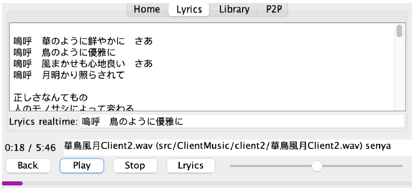

# csci3280Project

## Brief Description

This is a pure Java application with zeroMQ. It is a music player that supports P2P function with basic player requirement.

## Program’s Operation Manual (README)

For Windows devices, please run commands in Developer Command Prompt, use “nmake” instead of “make”, and replace all colons (“:”) with semicolons (“;”) in “makefile” file.

- Server Side
  open the server by typing `make run-ts` in Terminal in folder “Phrase1”, then input the server address (default is port 4444)

- Client Side
  - Open Program
    open the server by typing `make run-mp` in Terminal in folder “Phrase1”, then the
    application will start and appear.
  - Load Music Location
    Click “Library” Tab on the top.
    In library path, input your path and click “SYNC” button.
    
    The list will display the music from the path.
- Music Management
  The music will be displayed in Library Tab.
  
  Search Music by inputting the keyword on textbox and click “search” button
  
  We can click one song and click “Play” button to play it, click “Pause” to pause and click “Stop” to end the song. The range input on the right is the volume control.
  
  We can click “Lyrics” button in the bottom of “library” Tab or click “Lyrics” tab to switch to “Lyrics” tab.
  The lyric will appear in the “Lyrics” tab and support synchronized lyric display.
  
- P2P
  Make sure the server is on.
  In “P2P” tab, input the server IP and client IP, then click “Connect” Button.
  
  Then this application is connected to server and can use P2P sync function.
    - Assume two client is online:
        
        When we click the “P2PSync” button in one of the clients, other client songs will sync to that client song list.
        
        And those songs can be played.
        

### Third-party Libraries
- ZeroMq for socket connection
## Phrase 1 feature:

- Basic User Interface
  
- Music Decoding and Playback
- Music Management
- Information Display
  
- Music Searching
- Lyrics Display (with LRC)

## Phrase 2 feature

- Network connection
  Users are required to connect to a tracker server. Then the subsequent actions willpull the peer list from the server and send requests to the peers.

- Music Searching
  All music from peers is pulled to the “Library” tab. Such music will have the “tcp” column filled if not contained in the local library. Otherwise the column is empty.
- Availability Check
  Availability check is done when users try to play music not existing locally. It asks all peers for the music, and those peers either send a ‘1’ for available or ‘0’ otherwise.

- Real-Time Audio Streaming, and Peer-to-Peer Playing. After availability check, the user asks peers with music available for audio chunks.
  Received chunks will be written to a Stream in order. MusicPlayer will read data from the Stream if there is data available. If multiple peers said the music is available, the audio chunk index requested will be interleaved along peers.

### InterleavingBitmaps.java

1. To test the interleaving bitmap feature, first compile the InterleavingBitmaps.java:

   > `javac InterleavingBitmaps.java`

2. Then run the code:
   > `java InterleavingBitmaps`

This is a Java program that takes a set of bitmap images stored in a folder called "p2pDemo", and saves the result as a new bitmap image named "interleaved_bitmap.bmp" in interleaving.

### Enhanced Features you have implemented

- Synchronized lyric display
  
  realtime lyrics are displayed at the “Lyrics realtime” in the “Lyrics” tab.
- Progress bar
  A progress bar is placed at the bottom of the UI. The current progress of the music is calculated according to the current playback position of the music. Support Mac and Windows.

## Advance feature in phrase 2

- Support more than three clients
  
- Support more than two sources
  We support more than two sources when the user plays a locally unavailable music, as demonstrated in the “InterleavingBitmaps” part. First peer will have chunk 0,3,6,second peer will have chunk 1,4,7, third peer will have chunk 2,5,8 being requested accordingly.
